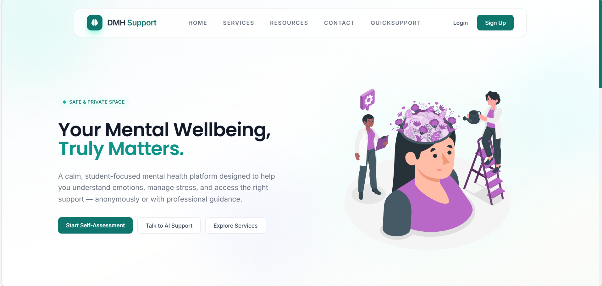
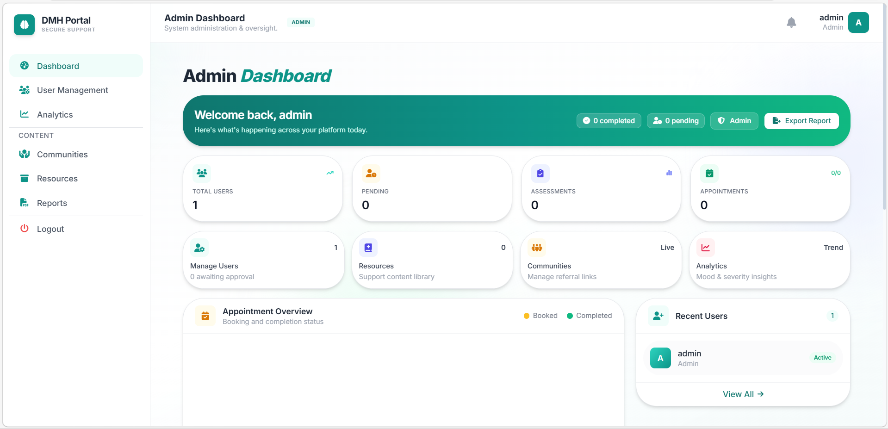
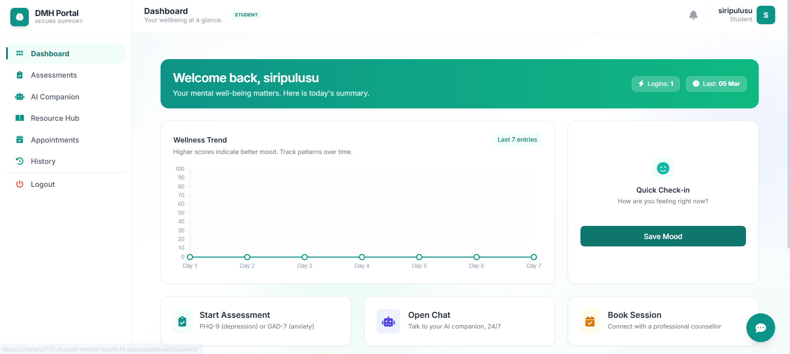
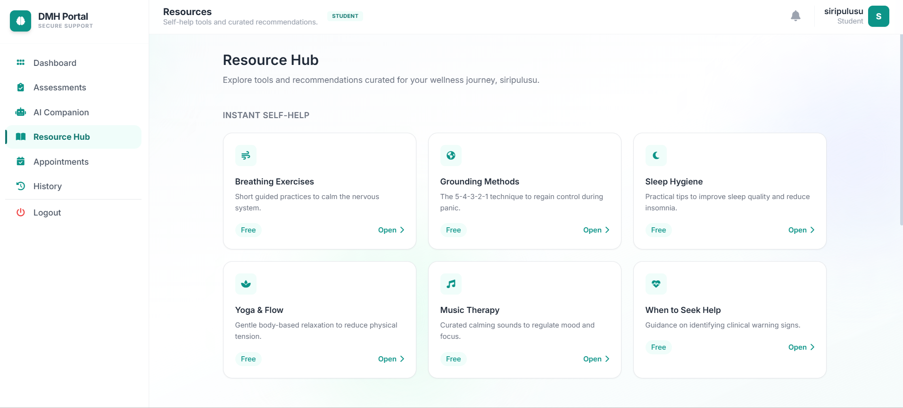

# Digital Mental Health and Psychological Support System


---

# Overview

The **Digital Mental Health and Psychological Support System** is an AI-powered web platform designed to support students' psychological well-being by providing accessible, confidential, and immediate mental health assistance.

Mental health challenges such as **stress, anxiety, depression, academic pressure, burnout, and emotional distress** have become increasingly common among students. However, many students hesitate to seek professional help due to **social stigma, lack of awareness, or limited access to counselors**.

This platform aims to bridge that gap by offering a **digital mental health support ecosystem** that integrates AI assistance, self-assessment tools, curated mental health resources, and wellness tracking.

The system acts as a **first-level mental health support system**, helping students monitor their emotional health and seek appropriate support when needed.

---

# Problem Statement

In modern academic environments, students face numerous mental health challenges including:

* Academic pressure and performance anxiety
* Emotional stress and burnout
* Social isolation and loneliness
* Sleep disturbances and unhealthy routines
* Lack of awareness about mental health resources

Despite the growing need for mental health support, many educational institutions lack **accessible and stigma-free mental health systems**.

Students often avoid seeking help due to:

* Fear of judgment
* Lack of immediate support
* Limited counseling availability
* Lack of awareness about mental wellness

Therefore, a **digital platform capable of providing immediate, private, and accessible mental health support is essential**.

---

# Objectives

The primary objectives of this system are:

* Provide **instant mental health assistance through AI-based support**
* Encourage **mental health awareness among students**
* Provide a **safe and confidential environment for emotional expression**
* Help students **monitor their mental well-being**
* Offer **self-help resources and coping strategies**
* Guide users toward **professional help when necessary**

---

# Key Features

## AI Mental Health Companion

An AI-powered chatbot provides emotional support and guidance to users.

Capabilities include:

* Conversational emotional support
* Answering mental health related queries
* Providing coping strategies
* Guiding users toward appropriate resources

The chatbot serves as the **first point of contact for students experiencing emotional distress**.

---

## Self-Assessment System

Students can take scientifically inspired mental health assessments to evaluate their emotional well-being.

Examples include:

* Depression screening assessments
* Anxiety evaluation tools
* Mental wellness check-ins

This helps users **understand their mental health status and track improvements over time**.

---

## Mood Tracking Dashboard

Users can log their mood regularly to track emotional patterns.

Benefits include:

* Monitoring mental health trends
* Increasing emotional awareness
* Early detection of mental health issues

---

## Resource Hub

The system includes a curated collection of mental health resources such as:

* Breathing exercises
* Grounding techniques
* Sleep hygiene guidance
* Yoga and relaxation exercises
* Music therapy resources

These resources help users **develop healthy coping strategies**.

---

## Appointment & Support System

Students can schedule sessions or access guidance from professional support systems if needed.

This feature ensures that users can **transition from digital support to professional help when required**.

---

## Admin Dashboard

Administrators can monitor and manage platform activity through a dedicated dashboard.

Admin features include:

* User management
* System analytics
* Resource management
* Appointment monitoring
* Platform activity insights

---

# System Architecture

The system follows a **client-server architecture**.

User → Web Interface → Backend Server → Database → Response

Process flow:

1. The user interacts with the web interface.
2. Requests are sent to the backend server.
3. The backend processes chatbot interactions, assessments, and resource requests.
4. Data is stored in the database.
5. Processed responses are returned to the user interface.

This architecture ensures **efficient communication and scalability**.

---

# Technology Stack

## Frontend

* HTML
* CSS
* JavaScript

## Backend

* Python
* Django Framework

## Database

* SQLite

## Development Tools

* Git
* GitHub
* Visual Studio Code

---

# Project Structure

DigitalMentalHealth
│
├── manage.py
├── requirements.txt
├── README.md
│
├── accounts/
├── appointments/
├── assessments/
├── chatbot/
├── dashboard/
├── pages/
├── resources/
│
├── templates/
│
├── static/
│   ├── css
│   ├── js
│   └── images
│
└── venv/

The project follows **Django's Model-View-Template architecture**, ensuring clear separation of data, logic, and presentation layers.

---

# Installation Guide

## Clone Repository

```bash
git clone https://github.com/siripulusu/DigitalMentalHealth.git
```

## Navigate to Project Directory

```bash
cd DigitalMentalHealth
```

## Create Virtual Environment

```bash
python -m venv venv
```

## Activate Virtual Environment

Windows

```bash
venv\Scripts\activate
```

Mac/Linux

```bash
source venv/bin/activate
```

## Install Dependencies

```bash
pip install -r requirements.txt
```

## Run Development Server

```bash
python manage.py runserver
```

## Open in Browser

```
http://127.0.0.1:8000
```

---

# Screenshots

## Home Page

The landing page introduces the platform and allows users to start mental health assessments, access AI support, or explore services.



---

## Admin Dashboard

The admin panel provides system monitoring tools including user management, analytics, and platform activity insights.



---

## Student Dashboard

The student dashboard displays personalized mental wellness insights, mood tracking, assessments, and AI support access.



---

## Resource Hub

The resource hub contains curated self-help tools including breathing exercises, grounding techniques, yoga practices, and sleep guidance.



---

# Use Cases

The platform can be used by:

* College students experiencing academic stress
* Individuals seeking emotional support
* Educational institutions promoting mental health awareness
* Students wanting to track their emotional well-being

---

# Future Enhancements

Possible improvements include:

* Advanced AI mental health models
* Sentiment analysis for emotional detection
* Anonymous peer support communities
* Mobile application development
* Integration with professional counseling services
* Personalized mental health recommendations

---

# Project Impact

This project aims to:

* Reduce mental health stigma
* Encourage early mental health intervention
* Provide accessible psychological resources
* Promote emotional awareness among students

By combining **technology with mental health support**, the platform contributes toward creating **healthier academic environments**.

---

# Acknowledgements

We would like to thank our faculty mentors and the open-source community for providing tools and frameworks that supported the development of this project.

---

# Contributors

P. Lakshmi Siri – 22BQ1A42C9
P. Chetan Mani Krishna – 22BQ1A42B9
V. Vijay Kumar – 22BQ1A42H0
V. Sravya – 22BQ1A42G9

---

# License

This project is developed for **academic and educational purposes only** and is not intended to replace professional mental health services.
